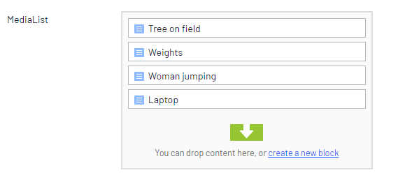
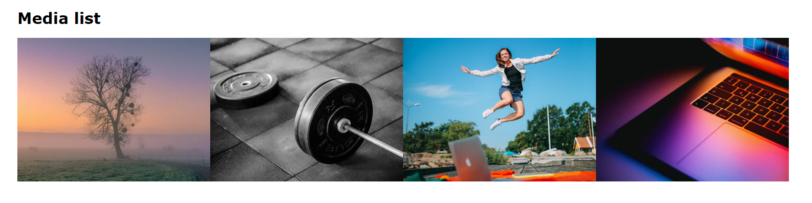

# Overview
This example shows how to use a content area and a media block to display a list of ImageVault media in Epi. The example uses a simple media block containing only a single `MediaReference` property, but can of course be extended to more complex variants.

The web editor works with a standard Epi content area, creating and rearranging blocks each representing a media:


The content area is rendered as a list:


The resulting markup looks something like this:

```
<ul>
    <li>
        
    </li>
    <li>
        
    </li>
    ...
</ul>
```

## Requirements
* Episerver CMS
* ImageVault.EPiServer.UI nuget package

## How to use
Place `MediaListPage.cs` and `MediaBlock.cs` with your other page and block models in your Epi project (typically `Models`). Place the `MediaListPage.cshtml` view with your block views (typically `Views/Shared`).

`MediaPageList.cshtml` describes how to render the content area as a list.
